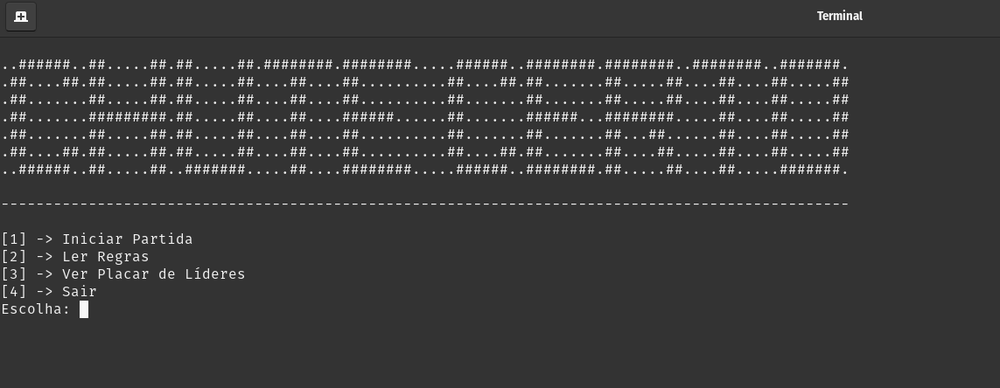
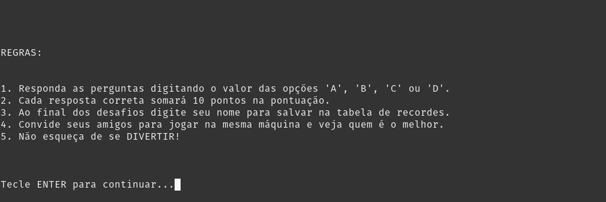
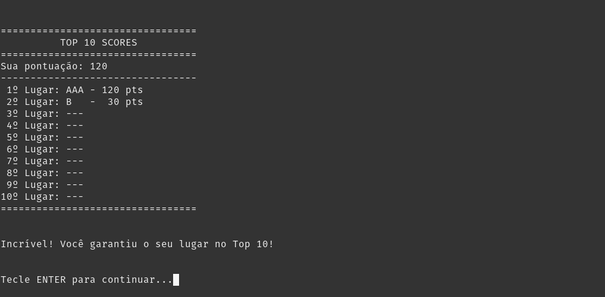
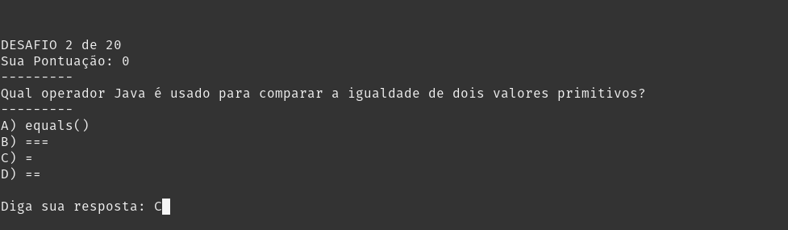

# Chute Certo

O Chute Certo é uma proposta de Projeto Integrador do curso de Tecnologia em Análise e Desenvolvimento de Sistemas que teve como requisito ser uma aplicação simples no terminal que receba interações do usuário.

Consiste num quiz com perguntas aleatórias com o tema "Copa do Mundo" que envolve algumas áreas das ciências como matemática, português, geografia e conhecimentos gerais para auxiliar no desenvolvimento pedagógico de crianças do ensino fundamental.

## Screenshots






## Pré-requisitos

Para compilar e executar este projeto, você precisará apenas ter instalado:

* **JDK 14** (ou superior) - [Baixar OpenJDK](https://jdk.java.net/archive/)

> **Nota:** Este projeto utiliza recursos do Java 14, portanto, versões anteriores (como Java 8 ou 11) não são suportadas. Recomenda-se usar uma versão TLS superior como Java 17.

## Como executar o Chute Certo (usuário final)

Para conseguir rodar o programa na sua máquina, você precisa da versão mínima do JDK listada na seção de pré-requisitos acima.
Baixe o arquivo chute-certo-v%version%.zip, disponível na [página de release](https://github.com/Allan-Jackson/chute-certo/releases/latest), descompacte na sua máquina e siga os passos abaixo:

### Windows

Na pasta principal do projeto, dê permissão e execute o arquivo `iniciar-chute-certo.bat`.

### Linux

Na pasta principal do projeto, dê permissão e execute o arquivo `iniciar-chute-certo.sh`.

> Os arquivos são scripts que irão executar o Java Archive do projeto.

## Desenvolvimento

Se você deseja buildar o projeto e executar você mesmo, ou se deseja contribuir para o desenvolvimento, siga as etapas abaixo para clonar e executar o projeto no seu terminal.

1. Clone o repositório:
   
   ```bash
   git clone https://github.com/Allan-Jackson/chute-certo
   ```

2. Navegue até a pasta:
   
   ```bash
   cd chute-certo/
   ```

3. Compile o projeto usando o javac:
   
   ```bash
      javac -d out src/br/com/senac/begods/chutecerto/Main.java
   ```
   
   | comando                      | descrição                                                                                              |
   |:----------------------------:|:------------------------------------------------------------------------------------------------------ |
   | **-d** out                   | (Directory) Informa ao Java em qual pasta guardar as classes compiladas.                               |
   | src/br/com/senac...Main.java | O caminho completo (na estrutura de pastas) da classe que contém o método main com a extensão '.java'. |

4. rode o projeto usando o comando java:
   
   ```bash
   java -cp out br.com.senac.begods.chutecerto.Main
   ```
   
   | comando             | descrição                                                                     |
   |:-------------------:|:----------------------------------------------------------------------------- |
   | **-cp** out         | (Classpath) Informa ao Java em qual pasta procurar as classes compiladas.     |
   | br.com.senac...Main | O caminho completo (Fully Qualified Name) da classe que contém o método main. |

## Ferramentas Utilizadas

* [Java 14](https://jdk.java.net/archive/)
* [Text to ASCII Art Generator](https://patorjk.com/software/taag/)
